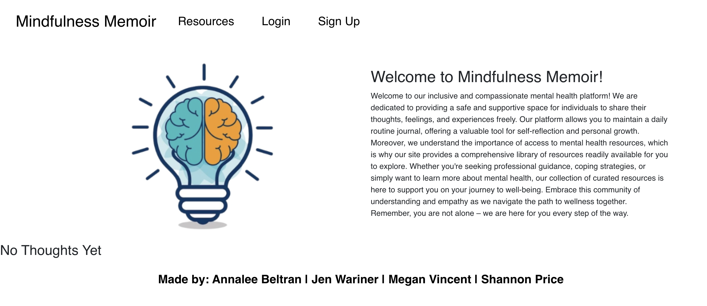

# Mindfulness Memoir

## Description
Mindfulnes Memoir is a mental health tracker that allows users to track their mood, journal their thoughts, and track daily tasks like physical activity, getting sunlight, etc. The goal of Mindfulness Memoir is to help users become more aware of their mental health and to help them find a balance between their mental and physical health.

# User Story

* AS A human juggling multiple responsibilities, I sometimes find it challenging to keep track of my mental health and emotional fluctuations
* I WANT a user-friendly app that can help me monitor and improve my mental well-being on a daily basis
* SO THAT I can be more aware of my mental health and make adjustments to my daily routine to improve my mental well-being

## Table of Contents
* [Installation](#installation)

* [Usage](#usage)

* [Credits](#credits)

* [Deployment](#deployment)

* [Languages](#languages)

## Installation
To install necessary dependencies, run the following command:

* npm i
* npm run develop

## Usage
 
<!-- this is where the screenshot of the image will be at -->

## Contributing

* Shannon Price - https://github.com/shannonkprice00
* Megan Vincent - https://github.com/MVincent15
* Jen Wariner - https://github.com/JenWariner19
* Annalee Beltran - https://github.com/annaleebeltran

## Deployment
* https://morning-waters-68042-3ca90f8eed1f.herokuapp.com/

## Languages
* JavaScript, HTML, CSS, Node.js, Express.js,Heroku, Moment.js, Bootstrap, Mongo_DB and Mongoose

